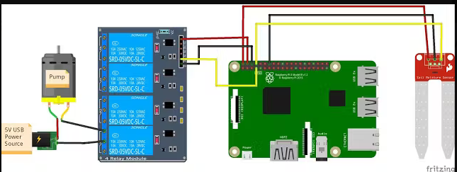

# Garden-Site
Garden website with hardware (Raspberry PI, Arduino, Django, Python)

## Hardware Materials

[Raspberry Pi 3](https://www.raspberrypi.com/products/)

[Soil Moisture Sensor](https://www.sparkfun.com/products/13637?gad_source=1&gclid=EAIaIQobChMIj8T_0K3-hQMVyF5_AB1TMArrEAQYAyABEgI7K_D_BwE)

[Flexible Water Line](https://www.amazon.com/gp/product/B0002AQI9A/ref=oh_aui_detailpage_o04_s00?ie=UTF8&psc=1&tag=cyberomelette-20)

[5V Relay](https://www.amazon.com/gp/product/B0057OC5O8/ref=as_li_tl?ie=UTF8&tag=cyberomelette-20&camp=1789&creative=9325&linkCode=as2&creativeASIN=B0057OC5O8&linkId=79128c0fb9efa41048a1490b5007a164&th=1)

[3-6V Mini Micro Submersible Pump](https://www.amazon.com/3V-6V-Submersible-Brushless-Magnetic-Driving/dp/B07KNT8XL6/ref=sr_1_8?dib=eyJ2IjoiMSJ9.5uwu46ju-Z9V5HEkNLJOnxCxtiHD4uhCWehTzEtizTw53c6XPmh2dW6sDLNFkz_wbtIIs8i-15C0Y4Vu8jERQoGgGFEeJfmppj2aok2Ufv4qKDcA_r10Qh8tANTzqbYWmMdFUhg2-sI8CJNkM3WTox40X_c4mwTF465GtMOmu1aMcgvkogROMucdE0jJjsnozhJBkm_XY7mXNcBy0mvjhkes9iKoqHveuqjoTGKWNjegCa1O42-qLfelFAGGjl-B1kpB0ShYvLTwNArwZvxjsQ_uJZKYawKAqM01Flr31Jc.MXT-GUu5EvRAxOxpv6rThNM5eBV49FdtgN0DK294enU&dib_tag=se&keywords=3-6V+Mini+Micro+Submersible+Pump&qid=1715182035&sr=8-8)

    5v Power Supply

## Wiring for Arduino

Water Sensor - plug the positive lead from the water sensor to pin 2, and the negative lead to pin 6. Plug the signal wire (yellow) to pin 8.

Relay - Plug the positive lead from pin 7 to IN1 on the Relay Board. Also connect Pin 2 to VCC, and Pin 5 to GND on the Relay board.

Pump - Connect your pump to a power source, run the black ground wire between slots B and C of relay module 1 (when the RPi sends a LOW signal of 0v to pin 1, this will close the circuit turning on the pump).

This diagram should capture the correct GPIO so long as you are using Raspberry Pi 3. Not shown is another power source to the RPi. 

